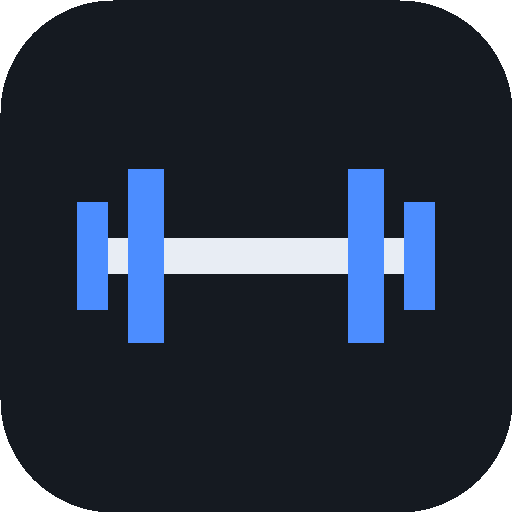
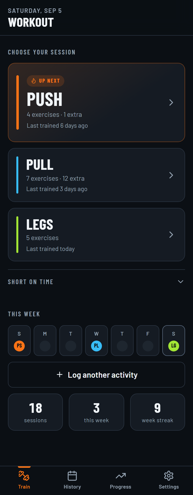
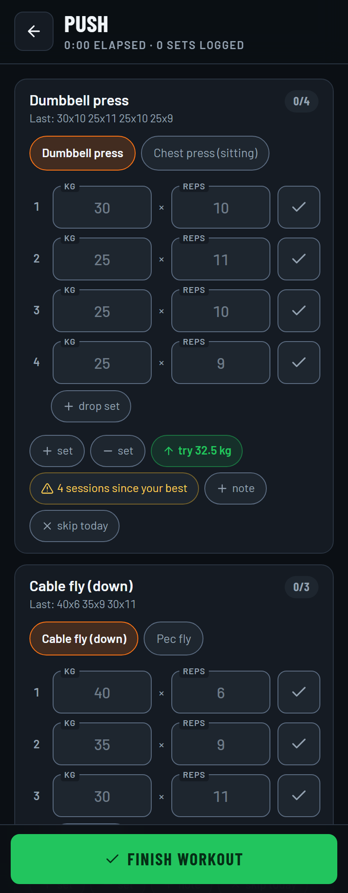
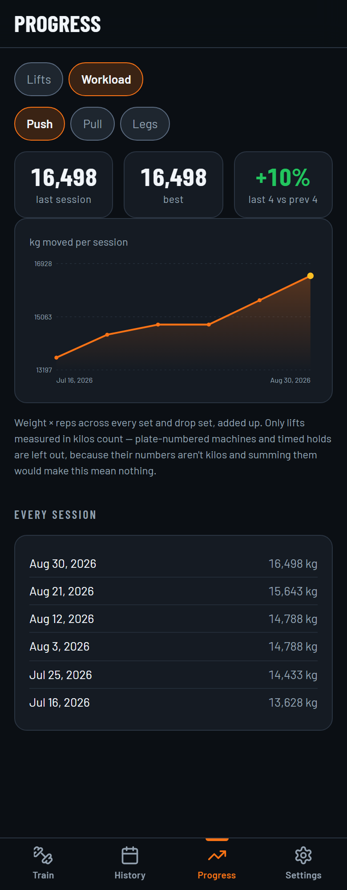
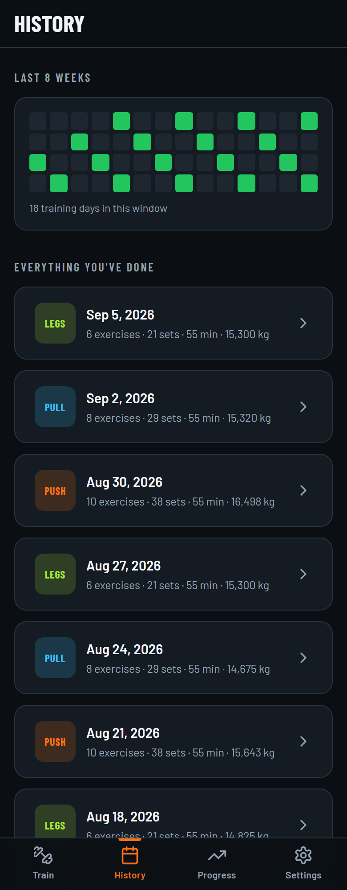
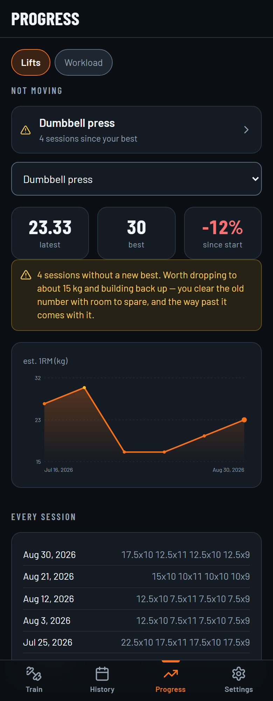

<div align="center">



# Workout Tracker

**Your gym notes, turned into an app you keep on your home screen.**

Workout sessions that open with last time's weights already filled in.
No account, no server, no signal required.

<a href="https://workout-tracker-ssd.vercel.app/"></a>
<a href="#make-it-yours"></a>

<br>


<br>

<table>
<tr>
<td width="33%"></td>
<td width="33%"></td>
<td width="33%"></td>
</tr>
<tr>
<td align="center"><sub><b>Pick a day.</b> The overdue one is badged.</sub></td>
<td align="center"><sub><b>Last time is already in the boxes.</b></sub></td>
<td align="center"><sub><b>Every kilo you moved, per day.</b></sub></td>
</tr>
</table>

</div>

---

## The whole idea

Most tracker apps make you *look up* what you lifted last time. This one puts it
in the box before you get there.

> You tap **Push**. Every exercise is already showing `85x9  80x8  75x8` in grey —
> exactly what you did last Push day. Hit ✓ on the ones you repeated, type over
> the ones that moved. A rest timer starts itself. You never search for anything.

Your sessions live in your phone's own storage. It opens in the basement gym
with no bars of signal, because after the first load it doesn't need the network
at all.

---

## What's in it

|  | |
| --- | --- |
| ⚡ **Last time, pre-filled** | Every set opens with the previous session's weight and reps as ghost numbers. One tap accepts them. |
| 🔀 **This-or-that exercises** | *Chest press* **or** *Dumbbell press* is a row of chips on one card. Each side keeps its own history and its own chart. |
| 🪜 **Drop sets, properly** | `70x8+55x3+45x3` is one set with three drops, and it round-trips exactly as written. |
| ⏱️ **Rest timer that starts itself** | Kicks off the moment you check a set off, then beeps and buzzes — reliably, even with the phone in your pocket. −15s / +15s if you need it. |
| 🙈 **Skip today** | Not feeling an exercise? It leaves the session but stays in your plan, and comes back in its original slot. |
| ⚠️ **Tells you when you're stuck** | Four sessions without a new best and the exercise says so — on the card, before you load the same weight again out of habit — with a lighter weight to restart from. |
| 📝 **Notes, two kinds** | A standing one per exercise (seat height, pin position) and one per workout (how you slept, what hurt), asked for at the moment you still remember. |
| ✏️ **Fix a saved workout** | Mistyped 250 for 25? Open the session in History and correct it. The prefill, the chart and your best all follow the correction — and deleting a workout logged by mistake genuinely undoes it. |
| 🏸 **Other activities** | Played squash instead? Log it in one tap. It counts towards your week and streak, so a rest day and a squash day don't look identical — but it never changes which gym session is up next. |
| 📈 **Progress & history** | Estimated 1RM per exercise, kilos moved per session, every saved workout, and an 8-week training grid. |
| 📱 **Edit exercises from the gym floor** | The machine you didn't know they had goes in from your phone, no laptop and no deploy. Rename one and it asks whether it's the same lift, so its history follows it. |
| ☁️ **Optional Drive backup** | Your data, in your own Google Drive, in a folder only this app can see. Off by default. |

<div align="center">

<br>
<sub>Eight weeks at a glance, then every session underneath it.</sub>
</div>

---

## Reading your progress

**Progress** has two halves, because "am I getting stronger?" and "am I doing
more work?" are different questions. **Lifts** answers the first, one exercise at
a time. **Workload** answers the second, one training day at a time.

### Lifts

Each session becomes one number, labelled *est. 1RM* — an estimate of the
heaviest single rep you could manage, worked out from a set you actually did.
You never have to attempt a true max to get it.

It uses the Epley formula, on your best set of that exercise that session:

```
est. 1RM  =  weight × (1 + reps / 30)
```

So `80x9` scores `80 × (1 + 9/30)` = **104 kg**. The point is comparability: it
turns `3×10 at 60 kg` and `1×5 at 85 kg` into one number, so the curve tells you
whether you're getting stronger without you having to eyeball weight and reps
separately.

Three things to know before you read too much into it:

- **It's your best set, not your workload.** Six hard sets and one hard set score
  the same if the top set matches. Total volume is shown per session in History.
- **Drop sets don't raise it.** `70x8+55x3+45x3` scores exactly like `70x8` — the
  drops are fatigue work, not a new strength ceiling. They do count towards volume.
- **It drifts optimistic above ~10 reps.** A 20-rep set estimates at `weight ×
  1.67`, which almost nobody could actually lift. The bias is consistent, so the
  *shape* of your curve stays honest even where the absolute number isn't.

Exercises measured in reps or seconds skip the formula entirely and chart *best
set* or *best hold* instead. The [manual](docs/MANUAL.md#how-progress-is-scored)
has the per-exercise details.

### When a lift stops moving



The chart going flat is the thing you most need telling about and the thing
you're least likely to notice, because nothing about loading the same weight
again feels like a decision.

So every exercise is counted against its own best. Four sessions without beating
it and it's flagged — as a chip on the card **during the workout**, while you can
still do something about it, and at the top of Lifts as a list, worst first.

Each one comes with somewhere to restart from: about a tenth lighter, rounded to
a jump your equipment can actually make. The point isn't the lighter weight, it's
clearing the old number with room to spare. Rep-only exercises get no
suggestion — "do fewer pull-ups" isn't a plan.

Counting from your best rather than a rolling average is deliberate: progressive
overload says the number goes up again sooner or later, so that's what it
measures you against. Four is low enough to catch a plateau early, high enough
that one tired week doesn't trip it.

<br clear="right">

### Workload

Workload adds up every kilo you moved — `weight × reps` across every set and
drop set — and charts it per session, with the last four compared against the
four before them.

It's always **one day at a time**, never a single combined line, and that's the
whole design. A Legs session moves several times the tonnage of a Push one, so a
combined chart would mostly track which day you happened to train rather than
whether you're doing more of anything.

Two things worth knowing:

- **Only kilos count.** Plate-numbered machines and timed holds stay out of the
  total — their numbers aren't kilos, and adding them in would make it mean nothing.
- **Dumbbell and one-arm work counts twice**, once you've said which exercises
  those are under **Settings → Which exercises count twice**. A set written
  `30x8` is 480 kg off your chest, not 240. It can't be guessed from the name, so
  it's a list you tick — and because workload is worked out fresh each time, one
  tick fixes your whole history, not just what comes next.

---

## Make it yours

The live demo above runs on one person's routine. The app has no sign-up because
it has no server, so "using it" means running your own copy with your own
exercises in it. That takes about five minutes and costs nothing.

**1. Grab the code**

```bash
git clone https://github.com/sartaj1995/workout-tracker.git
cd workout-tracker
npm install
npm run dev
```

**2. Paste in your own workout**

Open [`src/data/notes.ts`](src/data/notes.ts) and replace what's there with your
routine, written the way you'd scribble it in a notes app:

```
Push
Chest press (sitting) - 85x9 80x8 75x8 70x8+55x3+45x3
OR
Dumbbell press - 30x10 25x11 25x10 25x9
Lateral raise - 25x7 22.5x9 22.5x8

Cable crunch - 40x15 40x12
```

| You write | It means |
| --- | --- |
| `Push` / `Pull` / `Legs` / `Upper` | A day heading |
| `Name - 80x9 75x8` | An exercise, then `weight x reps` for each set |
| `70x8+55x3` | `+` chains drop sets onto one set |
| `OR` between two lines | The two are alternatives you pick between |
| A blank line inside a day | Everything under it is optional / extra work |
| `... (note)` after the sets | Becomes that exercise's note |
| A bare name with no ` - ` | Reuses an exercise from an earlier day — same history |
| `110s` or `20x45s` | A timed hold, or a carry measured in weight × seconds |
| `plate` before the sets | The numbers are pin positions rather than kilos |

Those starting numbers are just seeds; the app takes over from your first logged
session. Machines numbered by plate, and lifts counted in reps or seconds
instead of kilos, go in `OVERRIDES` at the bottom of the same file — the
[manual](docs/MANUAL.md#writing-your-notes) has the full reference.

You only have to get this roughly right. The same notes are editable inside the
app afterwards, so nothing here is a decision you're stuck with.

**3. Put it online and on your phone**

[](https://vercel.com/new/clone?repository-url=https://github.com/sartaj1995/workout-tracker)

Vercel detects Vite by itself — preset **Vite**, build `npm run build`, output
`dist`, no environment variables. Open the URL on your phone and use **Add to
Home Screen**. It then runs full screen with no browser chrome, and works with
airplane mode on.

Edit your notes later and redeploy; the app fingerprints them, notices the change
and rebuilds its exercise list on its own. Everything you've logged is left
untouched. Delete an exercise and it's *retired*, not erased — it stops being
offered, but its past sessions and chart still render.

Or skip the laptop entirely: **Settings → Edit exercises** opens the same notes
in the app, so you can add a machine while standing in front of it. Your edits
take over from the file at that point, and a redeploy won't overwrite them.
Renaming an exercise asks whether it's the same one under a new name, because
ids come from names and a silent rename would leave its history stranded.

---

## Vibe coded, on purpose

Every line of this app was written by [Claude Code](https://claude.com/claude-code).
Not scaffolded by it, not autocompleted by it — written by it, a pull request at
a time over a handful of days, from one person describing what they wanted in
the gym and what annoyed them about the last version.

The human contribution was the taste. This app exists because every workout
tracker on the store wanted an account and a subscription to do something a
paper notebook already does better. So the prompts were things like *"the
numbers should already be there"* and *"a fresh phone must never overwrite the
backup"* — decisions about behaviour, not instructions about code.

It's an honest look at where that gets you: about four thousand lines of
TypeScript with two runtime dependencies (React and React DOM), no component
library, no state library, no test suite, and a hand-rolled service worker. It's
also unapologetically single-user software — built for one routine, one phone,
one person. That's exactly why it's pleasant to use, and exactly why you should
fork it rather than sign up for it.

**If you want your own version of this**, that's the whole method: open Claude
Code in an empty folder, describe the app the way you'd describe it to a friend,
then keep using the thing and complaining about it until it's right.

---

## Going further

These live in the [manual](docs/MANUAL.md) rather than here, because you don't
need any of them to start:

- **[Editing exercises in the app](docs/MANUAL.md#editing-exercises-in-the-app)**
  — the notes syntax in full, what happens to history when you rename something,
  and why removing an exercise retires it instead of deleting it.
- **[Fixing a saved workout](docs/MANUAL.md#fixing-a-saved-workout)** — what a
  correction does to next session's prefill, your best, and the chart.
- **[Backing up to Google Drive](docs/MANUAL.md#backing-up-to-google-drive)** —
  optional and off by default. One backup file in your own Drive, re-uploaded
  after every workout you save, using a scope that can't see any of your other
  files. About fifteen minutes to set up. Until then, **Settings → Export
  backup** writes a JSON file whenever you want one.
- **[How it's built](docs/MANUAL.md#design-decisions)** — the project layout and
  the handful of decisions that explain the odd behaviours: substitute days that
  don't advance the rotation, one exercise shared across two days, and why
  editing your notes resets an in-app choice.

---

<div align="center">
<sub>Built for one gym routine. Fork it and make it yours.</sub>
</div>
